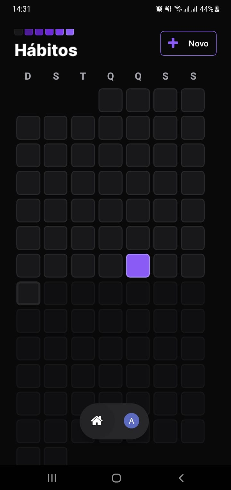

# Rn-Habits

.png)

## Ferramenta Mobile 

- Aplicação usando React Native
- Usando Expo
- NativeWind
- Async-Storage
- Google-signin
- Axios
- Zod
- Clsx
- Tailwind-merge
- Notifications

 

 ## Ferramenta Back-End
 - Nodejs
 - Typescript
 - Prisma
 - Fastify
 - @Fastify/cors
 - @Fastify/jwt
 - @Fastify/swagger
 - @Fastify/swagger-ui
 - Fastify-type-provider-zod
 - Zod

## Rodar o projeto Mobile

- primeiro instalar o nodejs versão LTS
- npm install para instalar todas as dependência
- npm start ou npx  expo  start para executar o projeto 
  
  ## Rodar o projeto Back-End

- primeiro instalar o nodejs versão LTS
- pnpm install para instalar todas as dependência
- pnpm  dev ou  pnpm run dev para executar o projeto 
